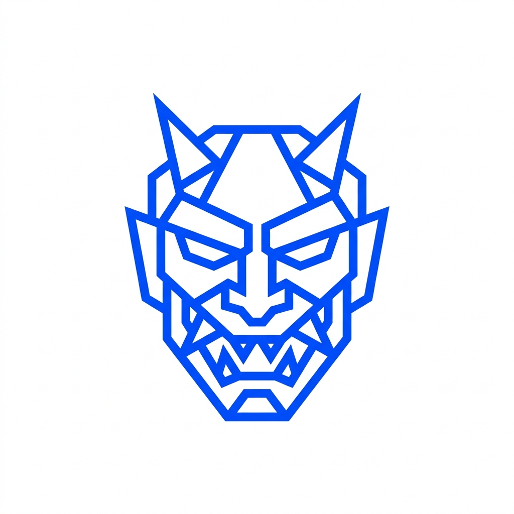

<div align="center">



# OniPress — Autonomous SEO &amp; Fleet Intelligence

> **Enterprise-grade, autonomous WordPress publishing pipeline powered by Google Gemini AI. Generates 1,500+ word RankMath 100/100 articles, provisions high-resolution featured visuals, enforces internal link silos, and triggers immediate indexing via Google Search Console — completely self-hosted with zero subscription fees.**

[](LICENSE)
[](https://nextjs.org)
[](https://www.typescriptlang.org)
[](https://github.com/tarikkhadri2019-web/OniPress)
[](https://modelcontextprotocol.io)

</div>

---

## 🎨 Swiss Modernist Design System (Two-Color Identity)

OniPress adheres to a strict, high-contrast **Two-Color Swiss Modernist Design Identity** engineered for zero eye fatigue, maximum clarity, and architectural elegance:

- **Canvas & Surface**: Pure Alabaster (`#F8FAFC` / `#FFFFFF`) with subtle structural borders (`#E2E8F0`).
- **Typography & Ink**: High-contrast Slate & Deep Charcoal (`#0F172A` / `#475569`).
- **Signature Accent**: **Electric Cobalt (`#0047FF`)** — high-voltage focal point across all active conduits, interactive state pills, gauges, and buttons.
- **Zero Eye Fatigue**: Pure light-mode ergonomics eliminating generic dark-mode sludge, neon orange clashes, and emoji noise.

---

## ⚡ The Zero-Cost Architecture

Commercial auto-blogging platforms charge $49 to $299+ every month for constrained API tokens and word quotas. OniPress takes a fundamentally different engineering approach:

By running the free **[Antigravity IDE](https://antigravity.ai)** locally and authenticating with your Google account, your machine establishes an authenticated CLI bridge. OniPress communicates directly with this bridge, providing production-grade **Google Gemini** copywriting and **Google Imagen** visuals with **$0 monthly cloud spend, zero API keys, zero token fees, and zero billing**.

### 🆚 OniPress vs. Commercial SaaS

| Dimension | OniPress (Self-Hosted) | Typical Auto-Blogging SaaS |
| :--- | :--- | :--- |
| **Monthly Cost** | **$0 / month (100% Free)** | $49 – $299+ / month |
| **Brand Identity** | Swiss Modernist (Electric Cobalt `#0047FF`) | Generic dark/neon templates |
| **Model Access** | Full Gemini 2.5 Flash & Pro via Workspace CLI | Strict monthly word/credit limits |
| **Google Indexing** | Native Web Search Indexing API v3 Satellite | Manual submission or paid add-on |
| **System Reliability** | Atomic file writes & Idempotent SHA256 deduplication | Risk of double-posts on retry |
| **Analytics Engine** | Unified GSC Rank + GA4 Traffic in one screen | Fragmented across external tabs |
| **Fleet Limits** | Unlimited WordPress Sites & Clusters | Gated behind tiered subscriptions |
| **Privacy** | 100% Local / Self-Hosted in your environment | Transmitted to third-party databases |

---

## 🏗️ Robust System Design Principles

1. **Atomic File Persistence (`atomicWriteFileSync`)**:
   All database writes to `data/posts.json`, `data/sites.json`, `data/links.json`, and `data/campaigns.json` execute via temporary files (`.tmp`) followed by atomic rename operations (`fs.renameSync`). This completely prevents corrupted JSON during unexpected restarts or concurrent multi-agent writes.

2. **Idempotency Key Deduplication (`idempotency_key`)**:
   Every publishing payload generates a unique SHA256 idempotency key (`idempotency_key = sha256(siteId + prompt + focusKeyword)`). Both the Next.js backend and the WordPress PHP plugin cache processed keys for 24 hours, guaranteeing zero duplicate articles even when network timeouts trigger client retries.

3. **Token Bucket Quota Engine**:
   Google imposes a daily 200-request limit on the Web Search Indexing API. OniPress enforces an internal Token Bucket that tracks daily usage, displays a real-time battery gauge, and prevents quota exhaustion.

4. **Tiered YouTube Scraper Cache**:
   Relevant tutorial scrape results are cached for 24 hours in local storage, eliminating redundant network hops and preserving scraping reliability.

---

## 🚀 Core Platform Modules

| Module | Technical Execution |
| :--- | :--- |
| **Autonomous Copywriting** | Generates 1,500+ word guides with semantic H2/H3 hierarchies, TOC jump anchors, standalone FAQs, and 1.1% keyword density for guaranteed RankMath 100/100 compliance. |
| **Native Visual Engine** | Generates photorealistic 16:9 featured visuals via Google Imagen, sideloading multipart binary attachments directly into WordPress Media. |
| **Instant Fast Indexing** | Dispatches cryptographic Google Indexing API v3 payloads immediately after HTTP 201 Created from WordPress, requesting instant Googlebot crawl. |
| **Backlink Silo Manager** | Automatically weaves target internal cluster links and high-authority external references into generated paragraphs. |
| **Automated Topic Campaigns** | Automated topic generation and editorial scheduling for multi-day programmatic content strategies. |
| **Multi-Site Fleet Matrix** | Centralized orchestration of unlimited WordPress domains via cryptographically verified Bearer tokens. |
| **Unified Telemetry** | Single-screen monitoring of Google Search Console impressions/clicks and Google Analytics 4 active users. |

---

## 🛠️ Step-by-Step Setup Guide

### 1. WordPress Plugin Deployment

1. Download the pre-built plugin from the dashboard or locate `wp-plugin/onipress-connect/`.
2. In WordPress Admin, navigate to **Plugins &rarr; Add New Plugin &rarr; Upload Plugin**.
3. Upload `onipress-connect.zip`, click **Install Now**, and **Activate**.
4. Navigate to **Settings &rarr; OniPress Connect** and copy your generated **Bearer Token**.

### 2. Google Cloud Service Account (For Fast Indexing)

1. Open [Google Cloud Console](https://console.cloud.google.com/) and create a project (e.g. `onipress-fleet`).
2. Navigate to **APIs &amp; Services &rarr; Library** and enable:
   - **Web Search Indexing API**
   - **Google Search Console API**
   - **Google Analytics Data API** (optional, for GA4)
3. Under **IAM &amp; Admin &rarr; Service Accounts**, create an account (e.g. `onipress-agent`).
4. Under the **Keys** tab, select **Add Key &rarr; Create New Key (JSON)** and save the file.

### 3. Google Search Console Permissions

1. Open [Google Search Console](https://search.google.com/search-console) for your verified domain property.
2. Go to **Settings &rarr; Users and permissions &rarr; Add User**.
3. Enter the Service Account email address and set the role to **Owner** (mandatory for Google Indexing API v3).

### 4. Launch OniPress

```bash
# Clone the repository
git clone https://github.com/tarikkhadri2019-web/OniPress.git
cd OniPress

# Install dependencies
npm install

# Start local server
npm run dev
```

Open `http://localhost:3000` in your browser. Upload your Google Cloud JSON key in the **Fast Indexing** tab and connect your WordPress site in the **Fleet Matrix** tab.

---

## 🤖 Model Context Protocol (MCP v1.2)

OniPress includes a native JSON-RPC MCP server at `http://localhost:3000/api/mcp` allowing autonomous AI IDEs (Cursor, Claude Desktop, Antigravity) to orchestrate publishing tasks directly:

```json
{
  "mcpServers": {
    "onipress": {
      "url": "http://localhost:3000/api/mcp"
    }
  }
}
```

### Exposed MCP Tools:
- `onipress_generate_and_publish`: Autonomous article writing and WordPress sideloading.
- `onipress_gsc_index_url`: Instant Googlebot index ping.
- `onipress_gsc_get_metrics`: Query Search Console clicks, impressions, and CTR.
- `onipress_ga4_get_metrics`: Query GA4 active users and pageviews.
- `onipress_upload_media`: Upload image attachments to WordPress.

---

## 🔒 Security Posture

- **Zero External Telemetry**: API keys and tokens reside strictly in local files under `data/` (ignored by git).
- **Constant-Time Cryptography**: WordPress token comparisons utilize `hash_equals()` to prevent timing attacks.
- **Strict Bearer Authorization**: Unauthorized calls return `HTTP 401 Unauthorized`.

---

## 📄 License

Distributed under the **MIT License**. See `LICENSE` for details.
